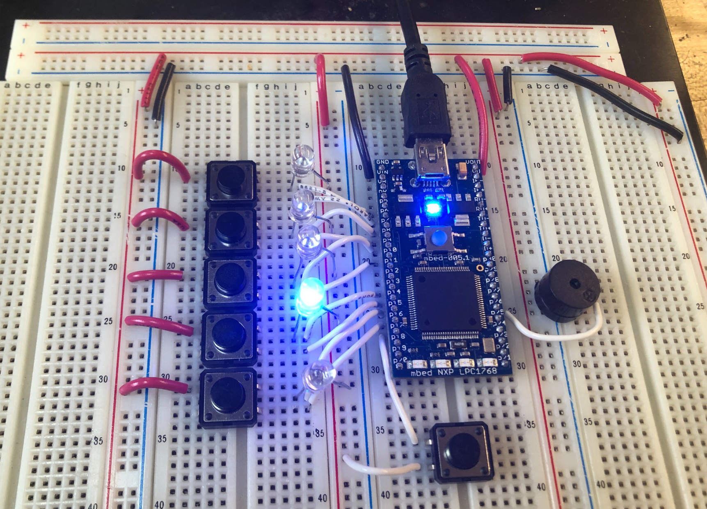

## Concept

 

### Introduction
Drüe, a piano-themed Whac-A-Mole game, aims to pull young children away from computer screens and help them develop hand-eye coordination, motor skills, and memory. On a basic level, Drüe can run classic Whac-A-Mole; however, different modes can be used to teach piano, test reaction time and improve memory. 

The system architecture works as follows. The Mbed signals which “mole” or “key” the user has to press. After the user presses the key, the Mbed processes the input depending on the mode it is currently operating in, thereby closing the loop. 

### Baseline Goals
The proposed milestones will be used to guide development. 
1. Fully figure out the mechanism for one key 
2. Implement selection menu and at least two modes, such as mini piano and reaction test 
3. Drüe runs Whac-A-Mole, along with a score-keeping LCD screen 

### Reach Goals
These goals outline other features that may be implemented if time permits. 
- Advanced Whac-A-Mole requires different types of inputs (e.g. hold key) 
- Drüe runs a memory test, akin to Simon 
- Drüe can teach piano 

### Technical Goal
From a technical standpoint, our goal is to create a self-contained product, complete with a custom PCB, clean enclosure, and power supply. We also wish to implement algorithms that make the project sound as piano-like as possible. 

## Alpha Prototype 
For the alpha prototype, a very simple version of Drüe was created using a breadboard, LEDs, and simple push buttons. As for the functionality, a very simple version of Whac-A-Mole was coded where a button press would play a tone only if the corresponding LED was lit. A seconday mode was also included where the buttons acted like a piano. 

The main problem we encountered was needing to debounce the buttons for two reasons. First, the buttons have a high frequency contact bounce that leads to buttons being read ad pressed multiple times. Second, it needs to be implemented such that if somebody presses and holds the button, the same tone just plays. We plan on doing extensive research on debouncing and implement it in hardware first. If it is not good enough, we'll also implement software fixes. 

 

The significance of the alpha prototype, however, is that we fully developed what we wish to accomplish with the custom PCB. They are listed in the next section. 

### Revised Goals
From this point forwards, our goals for this project have slightly shifted from the initially stated milestones. We wish for Drüe to have the following features:
1. **Music:** implement an algorithm to make Drüe sound like an actual piano
2. **Power Supply:** needs boost converter for 12V LED strips, but we also want to make it rechargeable 
3. **Keys:** we want to use as keys that are as piano-like as possible and need to implement debouncing (hardware first, then software if needed) 
4. **LEDs:** LED strips to light up keys, mode led indicators, and a display of some sort (not necessarily LCD because we want to shift our focus to the other goals) 
5. Will likely need an IO expander chip to have enough outputs 

## Beta Prototype
### Custom PCB
For the beta prototype, we focused a lot on designing the custom PCB so that we could place an order with all the parts and the board itself in time. [The schematic is documented here.](https://drive.google.com/file/d/10lLm03V6y-Dz138PPYxjpDKhYldybvl1/view?usp=sharing)

### Piano Sound Replication
We researched Karplus-Strong Algorithm and FM Synthesis for producing a piano sound, but found that neither were close enough. For this reason, we will likely go with the sampling route where audio files of a piano will be played from an SD Card. To keep our options open, however, we are maintaining a PWM output along with the AnalogOut output. For this week's demo, a PWM signal will still be used; however, a better speaker and an amplifier circuit were implemented. 

### Software (Demo) 
We temporarily removed the "wack-a-mole" functionality to focus on implementing debouncing and driving an I2C IO expander. On the front of the debouncing, we implemented a simple RC hardware fix first. The idea behind this fix is that the button input has to go through an RC circuit and charge the capcitor before the microcontroller receives the signal. This makes the random noise when pressing a button unable to reach the microcontroller. On the software side, we made it so the piano keys could only be pressed one at a time. That is, the keys are now dependent. 

For the I2C IO expander, we are working on getting them to light up representative LEDs. For the final project, it will be driving mosfets that control the LED strips on the keys. 

 

The goal for the baseline demo is to have the LEDs working and Whac-A-Mole coded to work with these LEDs. In addition, we'd like some sort of display added as well, be it an 8888 bar led display or a full SPI screen. 

## Baseline Demo
