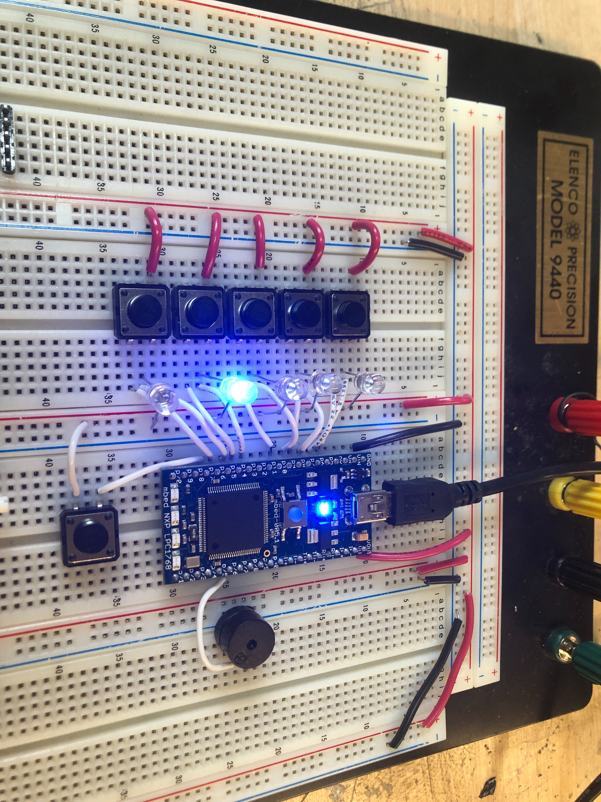

## Concept

### Introduction
Drüe, a piano-themed Whac-A-Mole game, aims to pull young children away from computer screens and help them develop hand-eye coordination, motor skills, and memory. On a basic level, Drüe can run classic Whac-A-Mole; however, different modes can be used to teach piano, test reaction time and improve memory. 

The system architecture works as follows. The Mbed signals which “mole” or “key” the user has to press. After the user presses the key, the Mbed processes the input depending on the mode it is currently operating in, thereby closing the loop. 

### Baseline Goals
The proposed milestones will be used to guide development. 
1. Fully figure out the mechanism for one key 
2. Implement selection menu and at least two modes, such as mini piano and reaction test 
3. Drüe runs Whac-A-Mole, along with a score-keeping LCD screen 

### Reach Goals
These goals outline other features that may be implemented if time permits. 
- Advanced Whac-A-Mole requires different types of inputs (e.g. hold key) 
- Drüe runs a memory test, akin to Simon 
- Drüe can teach piano 

## Alpha Prototype 
For the alpha prototype, a very simple version of Drüe was created using a breadboard, LEDs, and simple push buttons. As for the functionality, a very simple version of Whac-A-Mole was coded where a button press would play a tone only if the corresponding LED was lit. A seconday mode was also included where the buttons acted like a piano. 

The main problem we encountered was needing to debounce the buttons for two reasons. First, the buttons have a high frequency contact bounce that leads to buttons being read ad pressed multiple times. Second, it needs to be implemented such that if somebody presses and holds the button, the same tone just plays. We plan on doing extensive research on debouncing and implement it in hardware first. If it is not good enough, we'll also implement software fixes. 

 

The significance of the alpha prototype, however, is that we realized a lot of finer details we need to consider when designing the schematic for the custom PCB. 
1. We will likely need to use a IO expander chip to have enough outputs 
2. Most LED strips are powered off of 12V, so we need to pick battery configuration for that
3. A lot of speakers don't sound good, we need a better solution
4. As stated above, we need to implement debouncing 
 

The goal for the Beta Prototype is to shift over to the custom PCB and work with something closer to the final project. If the PCB has not been printed yet, we'll continue working with the current prototype, but clean up the code. 
